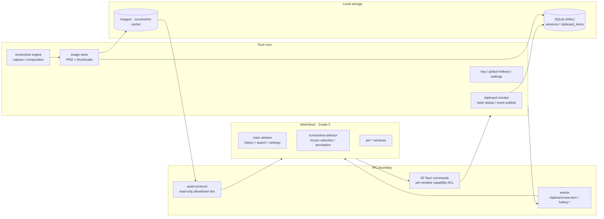

<div align="center">


# ClipMaster

A local-first clipboard manager for Windows: capture, search, and reuse text, links, images, and screenshots — nothing ever leaves your machine.

[简体中文](./README.md) · [Download](https://github.com/s1oopX/clipmaster-tauri/releases/latest) · [Roadmap](./docs/ROADMAP.md) · [Security Policy](./SECURITY.md)

[](https://github.com/s1oopX/clipmaster-tauri/actions/workflows/ci.yml)


</div>

## Overview

ClipMaster is a Windows desktop clipboard and screenshot tool built on Tauri 2: a Rust core owns clipboard monitoring, screenshot composition, image storage, and SQLite persistence, while a Svelte 5 UI running in WebView2 talks to the core exclusively through an ACL-guarded IPC command layer.

Three principles drive the design:

1. **Local-first** — no cloud sync, no accounts, no telemetry. The process makes no outbound network requests; all data stays in the local app data directory.
2. **Secure by default** — a strict CSP (no `unsafe-inline` anywhere), least-privilege capabilities isolated per window, an allowlisted asset protocol for file access, and backend path validation form four independent layers of defense.
3. **Deliberately bounded scope** — clipboard history plus a lightweight capture-and-use screenshot flow; no OCR, scrolling capture, or rich-text annotation platform (see [Product Boundaries](#product-boundaries)).

## Screenshots

<p align="center">
  
  
  
</p>
<p align="center">
  
  
</p>
<p align="center"><sub>Separate views per content type (text / links / images) · Settings and retention · Pinned image window</sub></p>

**Why split views instead of one stream**: the three content types are recovered differently — text by
search, links by their detected address, images by thumbnail. Merged into a single timeline, all three
get harder to find.

## Features

| Module | Capabilities |
| --- | --- |
| Clipboard history | 500ms polling capture of text / links / images, content-hash dedup within a 5-minute window, event-driven UI updates |
| Link workflow | URLs recognized as a dedicated `link` type, normalized dedup, one-click open in the system default browser |
| Search & filter | FTS5 trigram full-text index (CJK substring capable), type / date / session filters, favorites and pinning, backend pagination |
| Image workflow | PNG original + thumbnail pairs archived per day; preview, copy back, pin to desktop |
| Region screenshot | Frozen-screen selection: drag, 8-handle resize, 1px arrow-key nudge; auto-copies to clipboard and saves to history |
| Annotation | Rectangle / arrow / pen / text / step badges / blur / mosaic / eraser with full undo–redo; annotations composite into the final output |
| Desktop pinning | Borderless always-on-top image windows with their own minimal permission set |
| Global hotkeys | Toggle main window with search focus, launch region capture; dual-hotkey recording with conflict validation |
| System tray | Close-to-tray residency; falls back to a visible main window when the tray is unavailable |
| Data governance | Cleanup by item count, age, and image lifecycle; pinned and favorited items are protected; one-click clear-all |
| Data migration | Versioned schema migrations (7 to date) and automatic legacy data directory relocation |

## Tech Stack

| Layer | Components |
| --- | --- |
| Desktop shell | Tauri 2 (`protocol-asset` + `tray-icon`) · WebView2 |
| UI | Svelte 5 · Vite · Lucide icons · flatpickr (date filtering) |
| Core | Rust 2021 · tokio (timers) · parking_lot (locks) · anyhow (errors) |
| Clipboard & capture | arboard (clipboard) · screenshots (screen capture) · image (encode/compose) |
| Storage | rusqlite (SQLite bundled, WAL + FTS5 trigram) |
| System integration | tauri-plugin-global-shortcut · tauri-plugin-single-instance |
| Time & identity | chrono · chrono-tz · nanoid · md5 (content-hash dedupe) |
| Tests | Vitest + Testing Library (frontend) · `cargo test` (Rust) |

SQLite is compiled in via the `bundled` feature rather than linked against a system library — one fewer
class of "that DLL isn't on the user's machine" failure at distribution time.

## Key Decisions

| Decision | Choice | Rejected | Cost |
| --- | --- | --- | --- |
| Desktop framework | Tauri 2 (WebView2 + Rust) | Electron | Depends on system WebView2; rendering differences are on us |
| Data boundary | Everything stays local, no account, no sync | Cloud sync / accounts | Moving machines means relocating the data directory by hand |
| Capture method | 500ms polling | OS clipboard event hooks | Up to 500ms latency, in exchange for stable cross-version behavior |
| Content typing | Separate views for text / links / images | One unified stream | Three list implementations, but all three stay findable |
| Pin vs. favorite | Two distinct markers | A single "star" | Two fields and two UIs, but they map to two time horizons |
| Screenshot placement | Captures land in clipboard history | A separate capture tool | Images mix into history, requiring an image lifecycle policy |
| Annotation model | Vector objects + undo stack | Direct pixel edits | An object tree in memory, but erasing stays undoable |
| Permission model | Per-window Capability | One global permission set | Three permission manifests to maintain |

Three worth expanding:

**Why pin and favorite are separate.** Pinning serves "needed again in a minute", favoriting serves
"might need this later" — two different time horizons. Merged into one marker, short-lived high-frequency
items push long-term keeps out of view, or the reverse. Neither participates in automatic cleanup, but
they sort differently.

**Why capture isn't a separate tool.** Screenshotting and copying are the same class of action: just
produced, needed immediately, possibly retrieved later. Splitting them means two histories and two search
entry points — while a user hunting for an image from two hours ago rarely remembers whether it was
captured or copied.

**Why "pause capture" is a requirement, not a nicety.** The clipboard is one of the most sensitive data
streams on a machine — passwords from a password manager and tokens from a terminal both pass through it.
Being able to stop collection before handling that content is a precondition for this class of tool.
Clearing history afterwards is damage control; pausing beforehand is control.

## Architecture



- **Process model**: a single Rust process owns every privileged operation; the three window classes (`main` / `screenshot-selector` / `pin-*`) interact with the core only through IPC and events — the frontend never touches the file system or clipboard directly.
- **Command layer**: 30 `#[tauri::command]` endpoints cover history CRUD, the screenshot lifecycle, image resolution, and window/settings management, with input validation centralized in the backend.
- **Event flow**: new clipboard items and global hotkeys are emitted by the core and subscribed to by the UI — no frontend polling.
- **Image path**: the database stores relative paths only; rendering goes through `resolve_image_asset` and the asset protocol, which serves two allowlisted directories read-only.

## Security Model

Clipboard history inherently contains passwords, tokens, and sensitive screenshots, so the security boundary is built as defense in depth — each layer fails independently:

| Layer | Mechanism | Where |
| --- | --- | --- |
| Content Security Policy | Global CSP with `unsafe-inline` banned (`script-src 'self'; style-src 'self'`), eliminating the inline-injection surface | `tauri.conf.json` |
| Window permission isolation | A dedicated capability per window class granting only required `core:` permissions (pin windows: drag / resize / close only) | `src-tauri/capabilities/` |
| File access allowlist | Asset protocol restricted to read-only `$APPDATA/images/**` and `$APPDATA/screenshot-cache/**` | `tauri.conf.json` |
| Path validation | Image paths must match the three-segment relative form `images/<date>/<file>`; absolute paths and `..` traversal rejected; external URLs pass through only after `http(s)` normalization | Rust command layer |
| Network boundary | No telemetry, no auto-update, no outbound requests; link opening is delegated to the system browser | Global |

The security configuration is locked by tests (`src/tauri-security-config.test.js`) — any regression of the CSP or asset scope fails CI. Vulnerability reporting is described in [SECURITY.md](./SECURITY.md).

## Data & Storage

- **Engine**: SQLite in WAL mode via `rusqlite`; `sessions` and `clipboard_items` tables with 6 query indexes covering the timeline, type, session, pin/favorite, and hash-dedup paths, plus a trigram FTS5 external-content table accelerating full-text search.
- **Dedup**: writes check `content_hash` within a 5-minute window — full-text hash for text, `link:`-prefixed normalized URL for links, dimensions + sampled bytes for images, preventing cross-type collisions.
- **Images**: PNG files with relative paths only, archived under `images/<YYYY-MM-DD>/` as original + `_thumb` pairs; record deletion best-effort removes both files.
- **Migrations**: a `schema_migrations` version table drives upgrades (7 versions to date, including legacy single-URL text-to-`link` conversion and FTS index backfill); legacy identifier directories are relocated on startup without overwriting newer data.
- **Cleanup**: three dimensions — max items, retention days, image lifecycle — with pinned and favorited records excluded.

Full schema and index definitions: [Database](./docs/DATABASE.md).

## Screenshot Pipeline

Region capture is built for the capture-then-use path, composed entirely locally:

```text
freeze screen snapshot → select region (drag / 8 handles / 1px nudge) → annotate (vector objects, undo/redo)
→ composite & export → system clipboard + history → optionally re-select / pin to desktop
```

- The main window is hidden before capture so the frozen frame never contains the tool itself, and restored afterwards only if it was visible.
- Annotations are object data rather than destructive pixel edits; erased annotations remain recoverable through the undo stack.
- Blur and mosaic redact sensitive regions before the output leaves the editor.
- Capability comparisons against mature screenshot tools: [Screenshot Feature Review](./docs/SCREENSHOT_REVIEW.md).

## Engineering Quality

| Gate | Scope | Status |
| --- | --- | --- |
| `npm test` (Vitest + Testing Library) | 16 test files, 87 cases: UI interaction, pagination, settings, security config, window lifecycle | Enforced in CI |
| `cargo test` | 68 Rust unit tests (67 passing / 1 ignored): database CRUD, migrations, FTS sync, session cleanup, path validation, settings | Enforced in CI |
| `cargo clippy --all-targets -- -D warnings` | Zero warnings across all targets | Enforced in CI |
| `cargo fmt --check` | Rust formatting | Enforced in CI |
| Security config tests | CSP / asset scope assertions preventing silent boundary regressions | Enforced in CI |

The backend is modularized with per-file size limits (commands and database layers are fully split); the frontend is organized into 12 Svelte components.

## Download & Install

Official installers are published on [GitHub Releases](https://github.com/s1oopX/clipmaster-tauri/releases/latest):

| File | Use case |
| --- | --- |
| `ClipMaster_x64-setup.exe` | NSIS installer, recommended for most users |
| `ClipMaster_x64_en-US.msi` | MSI package for traditional or enterprise deployment |
| `SHA256SUMS.txt` | Checksums for release artifacts |

Builds are not yet code-signed, so Windows SmartScreen may warn. Download only from this repository's Releases page and verify installers against the bundled SHA256 manifest. Artifact layout: [Release Artifacts](./docs/RELEASES.md); signing plan and status: [Signing](./docs/SIGNING.md).

## Development

Requirements: Windows 10/11 · Node.js 18+ · Rust stable · Visual Studio Build Tools (C++ workload).

```powershell
npm install          # install dependencies
npm run tauri:dev    # start the dev window (default port 5174, switchable in Settings)
npm run tauri:build  # build the exe plus NSIS / MSI installers
```

| Command | Description |
| --- | --- |
| `npm test` | Frontend tests (Vitest) |
| `npm run build` | Frontend production build |
| `cargo test` | Rust unit tests (run inside `src-tauri/`) |
| `cargo clippy --all-targets -- -D warnings` | Rust lints |
| `cargo fmt --check` | Rust formatting check |

Build outputs land in `src-tauri/target/release/` (exe) and its `bundle/nsis/` and `bundle/msi/` subdirectories.

## Project Layout

```text
src/                 Svelte frontend: entry, page logic, tests
src/components/      12 UI components (history panel, settings, pin shell, dialogs)
src/screenshot/      Screenshot window: selection, annotation, rendering, hit testing
src/lib/             IPC wrappers, config, UI utilities
src-tauri/src/       Rust core: commands / database / clipboard / tray / hotkey
src-tauri/capabilities/  Per-window permission declarations (main / pin / screenshot)
docs/                Architecture, API, database, privacy, troubleshooting, roadmap
scripts/             Dev port management and launch scripts
```

## Product Boundaries

ClipMaster will remain a local-first, lightweight tool. The following are **explicitly out of scope**: OCR, scrolling capture, cloud sync, auto-update, team/account systems, and rich-text annotation platforms. Screenshot features focus on cropping, basic shapes, and privacy redaction; rationale and decisions are recorded in the [Roadmap](./docs/ROADMAP.md).

## Privacy

- Clipboard history, images, and screenshots are stored under `%APPDATA%/com.clipmaster.desktop/` — never uploaded, synced, or phoned home.
- Pause monitoring before copying secrets, or clear all history at any time.
- Details: [Privacy](./docs/PRIVACY.md).

## Documentation

[Architecture](./docs/ARCHITECTURE.md) · [API](./docs/API.md) · [Database](./docs/DATABASE.md) · [Workflow](./docs/WORKFLOW.md) · [Privacy](./docs/PRIVACY.md) · [FAQ](./docs/FAQ.md) · [Troubleshooting](./docs/TROUBLESHOOTING.md) · [Signing](./docs/SIGNING.md) · [Roadmap](./docs/ROADMAP.md) · [Changelog](./CHANGELOG.md)

## Contributing

Issues and pull requests are welcome. Please read the [development workflow](./docs/WORKFLOW.md) first and add frontend / Rust tests appropriate to your change. Never paste real clipboard content, tokens, or passwords into public issues; report security problems through the [Security Policy](./SECURITY.md).

## License

[MIT License](./LICENSE)
