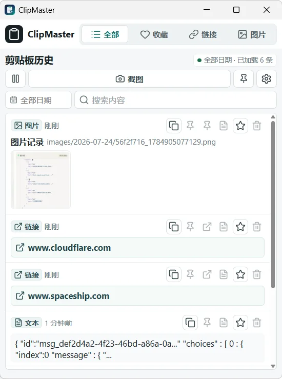
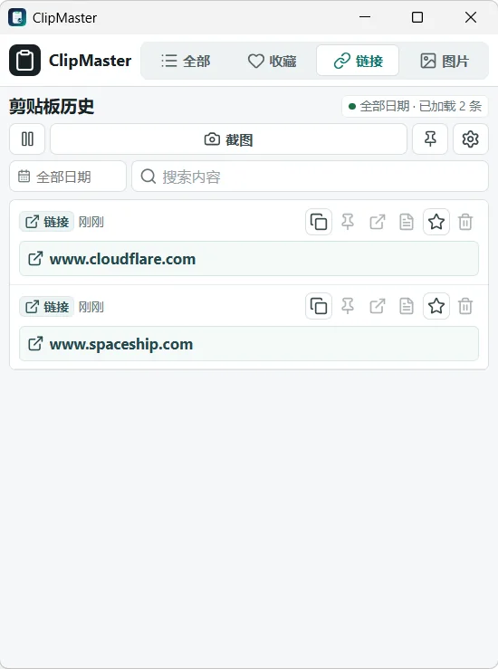
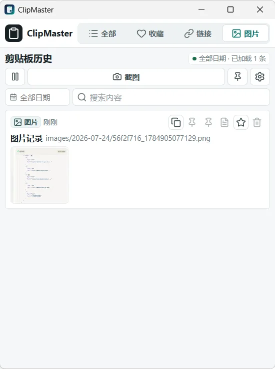
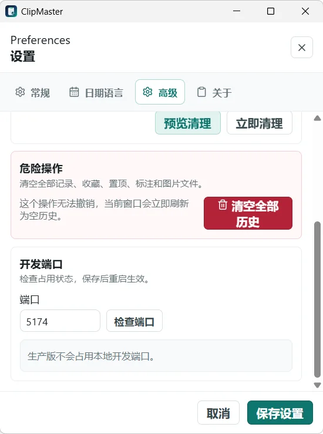
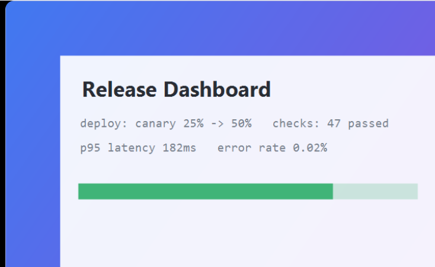
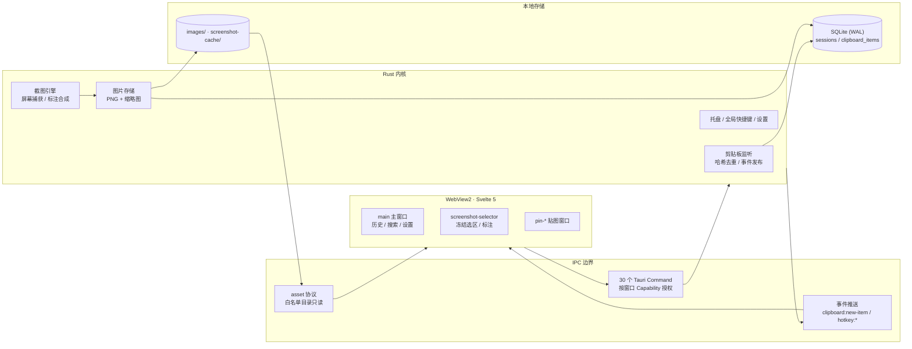

<div align="center">


# ClipMaster

本地优先的 Windows 剪贴板管理器：记录、检索、复用文本 / 链接 / 图片 / 截图，全部数据不出本机。

[English](./README.en-US.md) · [下载最新版](https://github.com/s1oopX/clipmaster-tauri/releases/latest) · [路线图](./docs/ROADMAP.md) · [安全策略](./SECURITY.md)

[](https://github.com/s1oopX/clipmaster-tauri/actions/workflows/ci.yml)


</div>

## 项目定位

ClipMaster 是一款面向 Windows 桌面的本地剪贴板与截图工具，采用 Tauri 2 架构：Rust 负责剪贴板监听、截图合成、图片存储与 SQLite 持久化，WebView2 中的 Svelte 5 界面通过受 ACL 约束的 IPC 命令层与内核通信。

设计上遵循三条原则：

1. **本地优先** — 不存在云同步、账号体系与远程遥测；进程不发起任何出站网络请求，数据仅落在本机应用数据目录。
2. **安全默认** — 严格 CSP（全局禁用 `unsafe-inline`）、按窗口隔离的最小权限 Capability、白名单化的 asset 协议文件访问、后端相对路径校验，四层防线独立生效。
3. **克制的功能边界** — 只做剪贴板历史与「截完即用」的轻量截图，不做 OCR、滚动截图、富文本标注平台（见[产品边界](#产品边界)）。

## 界面预览

<p align="center">
  
  
  
</p>
<p align="center">
  
  
</p>
<p align="center"><sub>三类内容各有独立视图（文本 / 链接 / 图片）· 设置与清理策略 · 桌面贴图窗口</sub></p>

**为什么按类型拆视图而不是一条流水**：三类内容的找回方式本来就不同 —— 文本靠搜索，链接靠识别出的
地址，图片靠缩略图。混在一条时间线里，三种都变难找。

## 核心特性

| 模块 | 能力 |
| --- | --- |
| 剪贴板历史 | 500ms 轮询捕获文本 / 链接 / 图片，内容哈希去重（5 分钟时间窗），事件推送实时上屏 |
| 链接工作流 | URL 自动识别为独立 `link` 类型，规范化去重，一键在系统默认浏览器打开 |
| 搜索与筛选 | FTS5 trigram 全文索引（中文子串可命中），类型 / 日期 / 会话筛选、收藏与置顶、后端分页加载 |
| 图片工作流 | PNG 原图 + 缩略图双份落盘，按日分目录，预览 / 复制 / 桌面贴图 |
| 区域截图 | 冻结屏幕快照后框选：拖动、8 控制点缩放、方向键 1px 微调，确认后自动写剪贴板并入历史 |
| 截图标注 | 矩形 / 箭头 / 画笔 / 文字 / 步骤编号 / 模糊 / 马赛克 / 橡皮擦，全链路撤销 / 重做，标注合成进最终输出 |
| 桌面贴图 | 图片以无边框置顶小窗贴到桌面，独立窗口、独立最小权限 |
| 全局快捷键 | 呼出 / 隐藏主窗口并聚焦搜索、启动区域截图；双快捷键录制与冲突校验 |
| 系统托盘 | 关窗即驻留托盘；托盘不可用时自动保持主窗口可见兜底 |
| 数据治理 | 按条数 / 天数 / 图片生命周期清理，收藏与置顶受保护；一键清空全部历史 |
| 数据迁移 | 版本化 schema migration（当前 7 版）与旧数据目录自动迁移 |

## 技术栈

| 层 | 组件 |
| --- | --- |
| 桌面框架 | Tauri 2（`protocol-asset` + `tray-icon`）· WebView2 |
| 界面 | Svelte 5 · Vite · Lucide 图标 · flatpickr（日期筛选） |
| 内核 | Rust 2021 · tokio（定时）· parking_lot（锁）· anyhow（错误） |
| 剪贴板与截图 | arboard（剪贴板）· screenshots（屏幕捕获）· image（编码合成） |
| 存储 | rusqlite（SQLite bundled，WAL + FTS5 trigram） |
| 系统集成 | tauri-plugin-global-shortcut · tauri-plugin-single-instance |
| 时间与标识 | chrono · chrono-tz · nanoid · md5（内容哈希去重） |
| 测试 | Vitest + Testing Library（前端）· `cargo test`（Rust） |

SQLite 用 `bundled` 特性静态编译进二进制，不依赖系统库 —— 桌面分发时少一类「用户机器上没有那个 DLL」
的故障。

## 关键决策

| 决策 | 选择 | 否决的方案 | 代价 |
| --- | --- | --- | --- |
| 桌面框架 | Tauri 2（WebView2 + Rust） | Electron | 依赖系统 WebView2；渲染差异要自己兜 |
| 数据边界 | 全部留在本机，无账号无同步 | 云同步 / 账号体系 | 换机器要手动迁移数据目录 |
| 采集方式 | 500ms 轮询 | 系统剪贴板事件钩子 | 有最长 500ms 延迟；换来跨版本行为稳定 |
| 内容分类 | 文本 / 链接 / 图片三类独立视图 | 一条统一流水 | 三套列表逻辑，但三类都好找 |
| 置顶与收藏 | 拆成两种标记 | 只做一种「标星」 | 两个字段两套 UI，但对应两种时间尺度 |
| 截图归属 | 截图直接进剪贴板历史 | 独立截图工具 | 历史里混入图片，需要图片生命周期策略 |
| 标注实现 | 矢量对象 + 撤销栈 | 直接改像素 | 内存里要维护对象树，但橡皮擦后仍可撤销 |
| 权限模型 | 每类窗口独立 Capability | 全局统一权限 | 三份权限声明要各自维护 |

几条值得展开：

**为什么置顶与收藏是两个东西。** 置顶服务「马上还要用」，收藏服务「以后可能用」—— 两种时间尺度。
合成一个标记后，短期高频项会把长期收藏挤下去，或者反过来。两者都不参与自动清理，但排序位置不同。

**为什么截图不做成独立工具。** 截图和复制在使用上是同一类动作：刚产生、马上要用、之后可能还要找回。
拆成两个工具意味着两套历史、两个搜索入口，而用户找一张两小时前截的图时并不记得它当初是「截」的
还是「复制」的。

**为什么「暂停采集」是必需项而不是锦上添花。** 剪贴板是最敏感的数据流之一 —— 密码管理器复制的口令、
终端里复制的 token 都会经过它。处理这类内容前能一键停下采集，是这类工具成立的前提；事后清理是补救，
事前暂停才是控制。

## 系统架构



- **进程模型**：单一 Rust 进程承载全部特权操作；三类窗口（`main` / `screenshot-selector` / `pin-*`）只通过 IPC 与事件与内核交互，前端不直接触碰文件系统与剪贴板。
- **命令层**：30 个 `#[tauri::command]` 覆盖历史 CRUD、截图生命周期、图片解析、窗口与设置管理；输入在后端统一校验。
- **事件流**：剪贴板新条目与全局快捷键均由内核 `emit`，前端订阅更新，避免 UI 侧轮询。
- **图片通路**：数据库只存相对路径；渲染时经 `resolve_image_asset` 解析并由 asset 协议按白名单目录提供只读访问。

## 安全模型

剪贴板历史天然包含密码、令牌与敏感截图，因此安全边界按纵深防御设计，各层独立失效不影响其余层：

| 层 | 机制 | 实现 |
| --- | --- | --- |
| 内容安全策略 | 全局 CSP 禁用 `unsafe-inline`（`script-src 'self'; style-src 'self'`），杜绝内联脚本注入面 | `tauri.conf.json` |
| 窗口权限隔离 | 每类窗口独立 Capability，仅授予所需 `core:` 权限（如贴图窗仅拖拽 / 缩放 / 关闭） | `src-tauri/capabilities/` |
| 文件访问白名单 | asset 协议仅允许 `$APPDATA/images/**` 与 `$APPDATA/screenshot-cache/**` 两个目录只读 | `tauri.conf.json` |
| 路径校验 | 图片路径强制 `images/<日期>/<文件>` 三段相对结构，拒绝绝对路径与 `..` 穿越；外链仅放行规范化后的 `http(s)` | Rust 命令层 |
| 网络边界 | 无遥测、无自动更新、无出站请求；打开链接委托系统默认浏览器 | 全局 |

安全配置由测试锁定（`src/tauri-security-config.test.js`），CSP 或 asset scope 的任何回退都会使 CI 失败。漏洞报告流程见 [SECURITY.md](./SECURITY.md)。

## 数据与存储

- **引擎**：SQLite（WAL 模式）via `rusqlite`，`sessions` 与 `clipboard_items` 两表，6 个查询索引覆盖时间线、类型、会话、置顶收藏与哈希查重路径，另有 trigram FTS5 外容表加速全文搜索。
- **去重**：写入前按 `content_hash` 在 5 分钟窗口内查重——文本取全文哈希，链接取 `link:` 前缀 + 规范化 URL，图片取尺寸 + 采样字节，避免类型间哈希碰撞。
- **图片**：仅存 PNG 文件与相对路径，按 `images/<YYYY-MM-DD>/` 分日归档，原图与 `_thumb` 缩略图成对管理，删除记录时 best-effort 同步清理文件。
- **迁移**：`schema_migrations` 版本表驱动升级（当前 7 版，含旧单 URL 文本 → `link` 类型迁移和 FTS 索引回填）；旧标识符数据目录在启动时自动搬迁且不覆盖新数据。
- **清理**：按最大条数、保留天数、图片生命周期三维度执行，置顶与收藏条目不参与自动清理。

完整 schema 与索引定义见 [Database](./docs/DATABASE.md)。

## 截图管线

区域截图面向「截完马上用」的路径，全程本地合成：

```text
冻结屏幕快照 → 框选（拖动 / 8 点缩放 / 1px 微调）→ 标注（矢量对象，可撤销 / 重做）
→ 合成导出 → 写系统剪贴板 + 存历史 →（可选）重新框选 / 钉到桌面
```

- 截图启动前自动隐藏可见的主窗口，避免冻结画面包含工具自身；结束后按需恢复。
- 标注为对象化数据结构而非像素涂改，橡皮擦删除后仍可经撤销栈恢复。
- 模糊 / 马赛克用于输出前遮蔽敏感区域。
- 与成熟截图工具的能力对照与取舍记录见 [Screenshot Feature Review](./docs/SCREENSHOT_REVIEW.md)。

## 工程质量

| 门禁 | 范围 | 现状 |
| --- | --- | --- |
| `npm test`（Vitest + Testing Library） | 16 个测试文件、87 个用例：UI 交互、分页、设置、安全配置、窗口生命周期 | CI 强制 |
| `cargo test` | 68 个 Rust 单元测试（67 通过 / 1 ignored）：数据库 CRUD、迁移、FTS 同步、会话清理、路径校验、设置 | CI 强制 |
| `cargo clippy --all-targets -- -D warnings` | 全 target 零警告 | CI 强制 |
| `cargo fmt --check` | Rust 格式 | CI 强制 |
| 安全配置测试 | CSP / asset scope 断言锁定，防止安全边界静默回退 | CI 强制 |

后端按模块拆分并约束单文件规模（commands / database 均已模块化），前端组件化为 12 个 Svelte 组件。

## 下载与安装

正式安装包发布在 [GitHub Releases](https://github.com/s1oopX/clipmaster-tauri/releases/latest)：

| 文件 | 适用场景 |
| --- | --- |
| `ClipMaster_x64-setup.exe` | NSIS 安装包，适合大多数 Windows 用户 |
| `ClipMaster_x64_en-US.msi` | MSI 安装包，适合传统部署与企业环境 |
| `SHA256SUMS.txt` | 发布文件校验清单 |

当前构建尚未代码签名，Windows SmartScreen 可能提示。请仅从本仓库 Release 页面下载，并用附带的 SHA256 清单校验安装包完整性。发布产物结构见 [Release Artifacts](./docs/RELEASES.md)，签名方案与接入进度见 [Signing](./docs/SIGNING.md)。

## 本地开发

环境要求：Windows 10/11 · Node.js 18+ · Rust stable · Visual Studio Build Tools（C++ workload）。

```powershell
npm install          # 安装依赖
npm run tauri:dev    # 启动开发窗口（默认端口 5174，可在设置面板切换）
npm run tauri:build  # 构建 exe 与 NSIS / MSI 安装包
```

| 命令 | 说明 |
| --- | --- |
| `npm test` | 前端测试（Vitest） |
| `npm run build` | 前端静态资源构建 |
| `cargo test` | Rust 单元测试（在 `src-tauri/` 下执行） |
| `cargo clippy --all-targets -- -D warnings` | Rust 静态检查 |
| `cargo fmt --check` | Rust 格式检查 |

构建产物位于 `src-tauri/target/release/`（exe）及其 `bundle/nsis/`、`bundle/msi/` 子目录。

## 项目结构

```text
src/                 Svelte 前端：入口、页面逻辑与测试
src/components/      12 个 UI 组件（历史面板、设置、贴图壳、弹层等）
src/screenshot/      截图窗口：选区、标注、渲染、命中检测模块
src/lib/             IPC 封装、配置与 UI 工具
src-tauri/src/       Rust 内核：commands / database / clipboard / tray / hotkey
src-tauri/capabilities/  按窗口拆分的权限声明（main / pin / screenshot）
docs/                架构、API、数据库、隐私、排障与路线图文档
scripts/             开发端口管理与启动脚本
```

## 产品边界

ClipMaster 将长期保持为本地优先的轻量工具。以下能力**明确不在**规划内：OCR、滚动截图、云同步、自动更新、团队 / 账号体系、富文本编辑器式标注平台。截图功能聚焦裁剪、基础形状与隐私遮挡；边界依据与决策记录见 [Roadmap](./docs/ROADMAP.md)。

## 隐私

- 剪贴板历史、图片与截图全部存储于 `%APPDATA%/com.clipmaster.desktop/`，不上传、不同步、无遥测。
- 复制密码等敏感内容前可暂停监听，或随时一键清空历史。
- 详见 [Privacy](./docs/PRIVACY.md)。

## 文档

[架构说明](./docs/ARCHITECTURE.md) · [API 文档](./docs/API.md) · [数据库说明](./docs/DATABASE.md) · [开发工作流](./docs/WORKFLOW.md) · [隐私与数据](./docs/PRIVACY.md) · [FAQ](./docs/FAQ.md) · [排障指南](./docs/TROUBLESHOOTING.md) · [代码签名](./docs/SIGNING.md) · [路线图](./docs/ROADMAP.md) · [变更记录](./CHANGELOG.md)

## 贡献

欢迎提交 issue 与 pull request。提交前请阅读[开发工作流](./docs/WORKFLOW.md)，并按改动范围补充前端 / Rust 测试。涉及剪贴板内容、令牌、密码等敏感数据的问题，请勿在公开 issue 中粘贴真实内容；安全问题走 [Security Policy](./SECURITY.md)。

## 许可证

[MIT License](./LICENSE)
