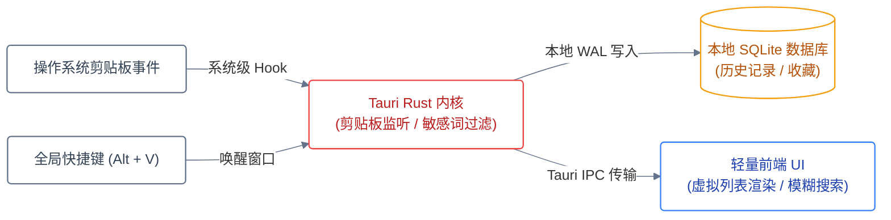

<div align="center">

# ClipMaster Tauri

**极简、轻量、本地隐私优先的跨平台剪贴板历史管理工具**

基于 Rust 与 Tauri 2.0 打造，内存占用 < 30MB。<br>
数据纯本地 SQLite 存储，支持全局快捷键秒级呼出、敏感信息正则自动过滤与模糊搜索。

[](LICENSE)
[](https://www.rust-lang.org/)
[](https://tauri.app/)
[](#系统要求)
[](#关键决策)

[快速开始](#快速开始) · [架构设计](#架构与数据流) · [关键决策](#关键决策) · [快捷键与操作](#快捷键配置)

</div>

---

## 解决的痛点

市面上的剪贴板管理工具大多面临两大问题：**Electron 方案内存占用高（动辄 300MB+）**，或**闭源工具存在剪贴板隐私泄露与联网上传风险**。

ClipMaster 坚持以下原则：
* **极致轻量**：以 Rust 为内核，空闲内存占用低于 30MB，秒级冷启动；
* **零网络外联**：纯本地离线运行，绝不发起任何网络请求；
* **敏感数据过滤**：自动识别并忽略密码管理器复制的敏感内容或私钥。

---

## 界面预览

<p align="center">
  
  
  
</p>
<p align="center"><sub>三类内容各有独立视图（文本 / 链接 / 图片）· 设置与清理策略</sub></p>

**为什么按类型拆视图而不是一条流水**：三类内容的找回方式本来就不同 —— 文本靠搜索，链接靠识别出的
地址，图片靠缩略图。混在一条时间线里，三种都变难找。

## 架构与数据流



---

## 关键决策

| 决策维度 | 采用方案 | 否决方案 | 代价与收益 |
|---|---|---|---|
| **桌面框架选型** | Tauri 2.0 (Rust + Webview) | Electron 框架 | 需配置本地 Rust 编译工具链，但将常驻内存从 300MB 压缩至 30MB 以内 |
| **存储介质** | 本地嵌入式 SQLite (WAL 模式) | 纯内存暂存 / 外部 KV 存储 | 增加了少许磁盘 I/O，但保障历史记录重启不丢且支持万级条目即时搜索 |
| **隐私保护策略** | 敏感正则过滤 + 忽略特定 App 源 | 记录全量剪贴板历史 | 偶尔可能漏记特定格式文本，但杜绝将 1Password/KeePass 密码明文沉淀入库 |
| **窗口渲染** | 虚拟滚动列表 (Virtual List) | 渲染全量历史 DOM | 增加了前端虚拟列表算法，但确保滚动 5000+ 条历史记录时恒定 60 FPS |

---

## 快速开始

### 开发环境依赖
* 安装 [Rust 工具链](https://rustup.rs/)（`cargo`、`rustc`）
* 安装 [Node.js](https://nodejs.org/) 与 `pnpm`

### 本地运行
```bash
git clone https://github.com/s1oopX/clipmaster-tauri.git
cd clipmaster-tauri

# 安装前端依赖
pnpm install

# 启动开发调试窗口
pnpm tauri dev
```

### 生产打包
```bash
pnpm tauri build
```
编译产物将生成在 `src-tauri/target/release/bundle/` 目录下（支持 `.msi`、`.dmg`、`.AppImage` / `.deb`）。

---

## 快捷键配置

默认全局快捷键可在设置中自定义修改：

| 快捷键 | 功能 |
|---|---|
| `Alt + V` (Windows/Linux) / `Option + V` (macOS) | 全局呼出 / 隐藏剪贴板搜索面板 |
| `Enter` | 粘贴所选条目至当前活动应用并隐藏窗口 |
| `Ctrl / Cmd + F` | 聚焦模糊搜索栏（支持拼音首字母匹配） |
| `Delete` | 删除当前选中记录 |
| `Ctrl / Cmd + D` | 收藏 / 取消收藏条目（置顶保护） |

---

## 许可

本项目基于 [MIT License](LICENSE) 开源。


