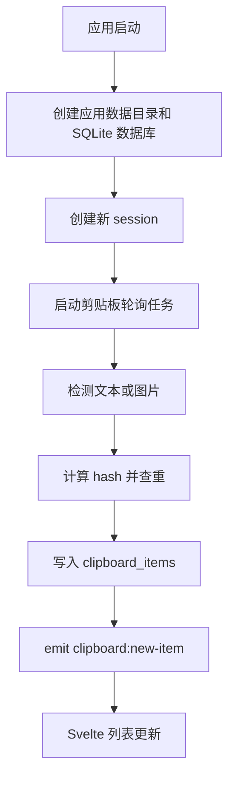

# Architecture

本文记录当前实现结构和后续演进方向。

## 技术栈

- Tauri 2
- Rust 2021
- Svelte 5
- Vite 8
- SQLite via `rusqlite`
- Clipboard via `arboard`

## 当前结构

```text
src/
  App.svelte          当前主 UI，包含列表、搜索、操作按钮和状态
  app.css             全局样式
  main.js             Svelte 入口
  lib/api.js          Tauri command 和事件封装

src-tauri/src/
  main.rs             Tauri 启动、状态注入、command 注册
  clipboard.rs        剪贴板轮询、去重、图片保存、事件推送
  commands.rs         前端可调用的 Tauri commands
  database.rs         SQLite 初始化和 CRUD
  models.rs           序列化模型
  session.rs          当前会话内存状态
```

## 运行流程



## 前后端边界

前端负责：

- 展示列表、搜索框、按钮状态。
- 调用 `src/lib/api.js` 中的 API。
- 监听 `clipboard:new-item`。
- 将图片相对路径转为 Tauri asset URL。

后端负责：

- 监听系统剪贴板。
- 保存文本和图片。
- 管理会话。
- 提供 SQLite 查询和状态切换。
- 写回文本到剪贴板。

## 需要重构的地方

`App.svelte` 已经变成单文件主控，后续建议拆成：

```text
src/lib/components/
  SearchBar.svelte
  ClipboardList.svelte
  ClipboardItem.svelte
  ImagePreview.svelte
  SessionSidebar.svelte

src/lib/stores/
  clipboardStore.js
  sessionStore.js
```

后端后续可拆成更清晰的服务边界：

```text
clipboard.rs     只负责读取系统剪贴板
image_store.rs   图片保存、删除、路径转换
database.rs      数据访问
cleanup.rs       自动清理
tray.rs          系统托盘
hotkey.rs        全局快捷键
```

## 风险点

- 剪贴板轮询每 500ms 执行一次，需要观察长期资源占用。
- 图片文件生命周期还没有和数据库删除绑定。
- SQLite schema 没有迁移系统。
- 当前搜索使用 `LIKE`，数据变多后可能变慢。
- 窗口关闭行为还没有和系统托盘策略统一。
