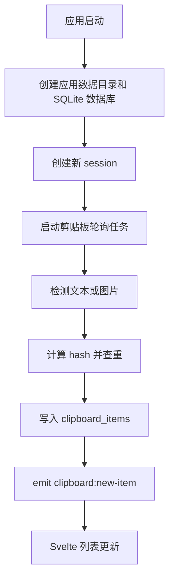

# Architecture

本文记录当前实现结构和后续演进方向。

## 技术栈

- Tauri 2
- Rust 2021
- Svelte 5
- Vite 8
- SQLite via `rusqlite`
- Clipboard via `arboard`

## 当前结构

```text
src/
  App.svelte          当前主控 UI，保留数据流、列表和设置流程
  app.css             全局样式和应用布局样式
  components/         低耦合 UI 组件：侧边栏、弹层、toast、贴图壳
  main.js             Svelte 入口
  lib/api.js          Tauri command 和事件封装
  lib/app-config.js   默认设置、筛选项和固定链接
  lib/clipboard-ui.js 剪贴板 UI 纯工具函数

src-tauri/src/
  app_data.rs         应用数据目录解析、测试覆盖和旧目录迁移
  main.rs             Tauri 启动、状态注入、command 注册
  clipboard.rs        剪贴板轮询、去重、图片保存、事件推送
  commands.rs         前端可调用的 Tauri commands
  database.rs         SQLite 初始化和 CRUD
  tray.rs             系统托盘、主窗口显示/隐藏、退出前 session 收尾
  models.rs           序列化模型
  session.rs          当前会话内存状态
```

## 运行流程



## 前后端边界

前端负责：

- 展示列表、搜索框、按钮状态。
- 调用 `src/lib/api.js` 中的 API。
- 监听 `clipboard:new-item`。
- 将图片相对路径转为 Tauri asset URL。

后端负责：

- 监听系统剪贴板。
- 保存文本和图片。
- 管理会话。
- 提供 SQLite 查询和状态切换。
- 写回文本和图片到剪贴板。
- 删除记录、清空会话和自定义清理时同步清理图片文件。
- 主窗口关闭时隐藏到托盘，托盘退出时结束当前 session。

## 需要重构的地方

`App.svelte` 已经完成第一轮瘦身：样式、配置常量、贴图壳、toast、删除确认、图片查看器、侧边栏和右键菜单已经拆出。后续建议继续拆：

```text
src/components/
  SearchBar.svelte
  ClipboardList.svelte
  ClipboardItem.svelte
  SettingsPanel.svelte

src/stores/
  clipboardStore.js
  sessionStore.js
  settingsStore.js
```

后端后续可拆成更清晰的服务边界：

```text
clipboard.rs     只负责读取系统剪贴板
image_store.rs   图片保存、删除、路径转换
database.rs      数据访问
cleanup.rs       自动清理
tray.rs          后续增加更多托盘菜单和状态提示
hotkey.rs        全局快捷键
```

## 风险点

- 剪贴板轮询每 500ms 执行一次，需要观察长期资源占用。
- 后续 schema 变更必须持续登记到 `schema_migrations`。
- 图片文件已随记录删除清理，但还没有孤儿文件扫描。
- 当前搜索使用 `LIKE`，数据变多后可能变慢。
- 进程被系统强杀时无法执行 session 收尾，只能依赖下次启动修正历史状态。
